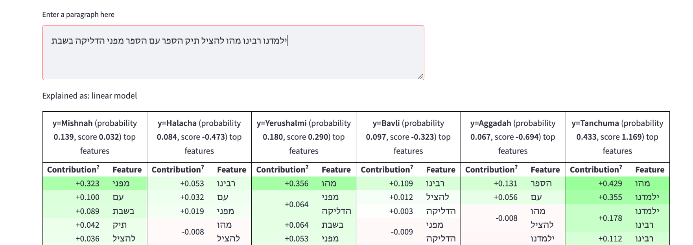

# Midrash-Style-Classification

This repository contains the code associated with our paper titled "Style Classification of Rabbinic Literature for Detection of Lost Midrash Tanhuma Material". 

## About The Project

In this project we aim to detect lost sections of Midrash Tanhuma by combining a text reuse engine with a style classification model.
Our method has proved useful when applied to Midrash anthologies such as Yalkut Shimoni.

## Paper
The paper associated with this project can be found [here](https://arxiv.org/abs/2211.09710).

## Streamlit Application

The Streamlit application associated with this project can be found in the [streamlit_app](./streamlit_app) directory.

## Contact

shlomotannor@mail.tau.ac.il
